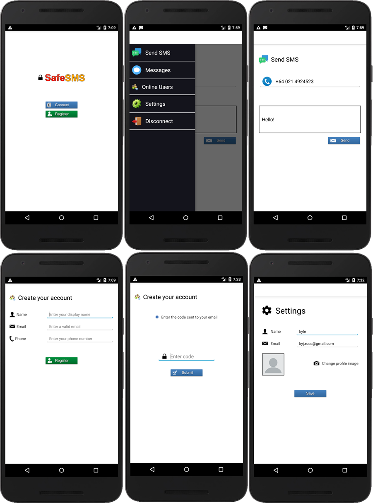

# Safe SMS

[](https://forthebadge.com)
[](https://forthebadge.com)



## About
Safe SMS is a secure mobile messaging app  
The app allows users to create an account and send secured SMS messages to their peers  
Safe SMS communicates with the [Safe SMS server](https://github.com/kyleruss/safesms-server) which acts as a public-key authority that stores the public keys of all registered users whereby a user can request the public key of another to encrypt an SMS message with 

### How it works
- When a new client wishes to join SafeSMS, they first register an account  
- All requests to the server are encrypted with AES 128bit using the servers public RSA key  
- If the client successfully registers, the server generates a random one-time limited 
password (for PBE) and emails it to the client for verification  
- This password is used by the client to generate a an ephemeral key for the request where the client  
generates a public RSA key and encrypts it along with a nonce value (to ensure it was not altered in transaction)  
with AES using the ephemeral key 
- The encrypted public key & nonce are sent to the server where the sever then stores the clients public key  
and responds to the client with the status of the request and the same nonce value (so the that client can verify)  
all encrypted using with AES using the clients public key
- Thereafter, a client can view a list of online users and their phone numbers then request from the server the public  
key of another user then encrypt their SMS messages with AES + the public key of the recipient to securely message

### Features
- User account registration
- Email verification
- Device authentication
- Change account settings
- View online users
- Secure public key store using PBE
- Send encrypted SMS messages
- Messages encrypted using AES 128 with recipient RSA public key

## Getting started

### Prerequisites
- JDK 1.8+
- Android Studio 3+
- Android 18-21 APIs
- [SafeSMS Server](https://github.com/kyleruss/safesms-server)
- [crypto-commons](https://github.com/kyleruss/crypto-commons)

### Installation
- Clone the SafeSMS repository
```
git clone https://github.com/kyleruss/safesms-client.git
```

- Import the SafeSMS project in Android Studio
- Start and deploy the SafeSMS server
- Run the SafeSMS android application


## License
Safe SMS is available under the MIT License  
See [LICENSE](LICENSE) for more details
